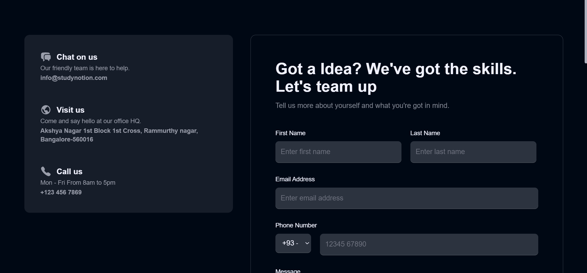
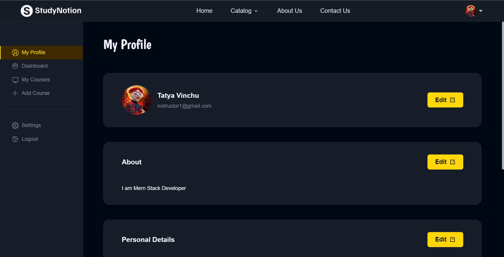
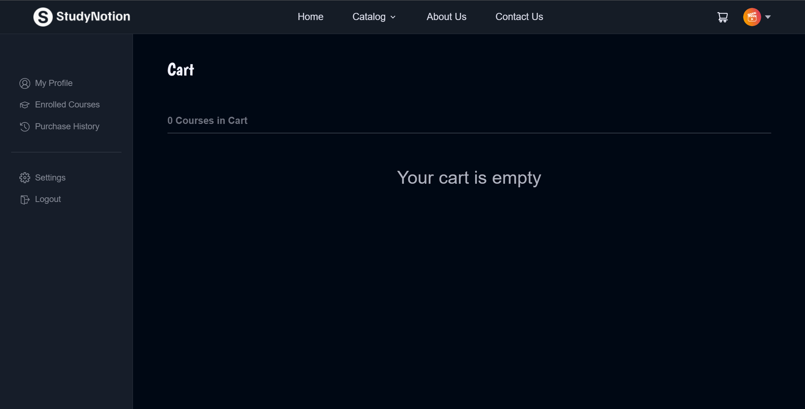
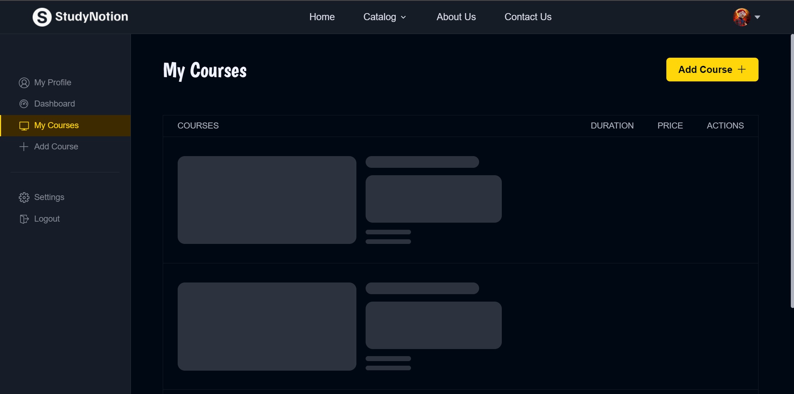

# StudyCircle - Complete EdTech Platform 🎓


## 📋 Project Overview

**StudyCircle** is a comprehensive Educational Technology platform built using the **MERN Stack** (MongoDB, Express.js, React.js, Node.js). The platform enables seamless creation, consumption, and management of educational content with advanced features for both students and instructors.

### ✨ **Key Features**
- 🔐 **Secure Authentication** with JWT and OTP verification
- 📚 **Course Management** with video, reading, and quiz content
- 💳 **Payment Integration** with Razorpay
- ☁️ **Cloud Storage** with Cloudinary for media management
- 📊 **Progress Tracking** and course completion system
- 🎨 **Responsive Design** with modern UI/UX
- 👥 **Role-based Access** (Student, Instructor, Admin)

---

## 🚀 **Live Demo**

- **Frontend**: [http://localhost:5173](http://localhost:5173)
- **Backend API**: [http://localhost:4000](http://localhost:4000)

---

## 🛠️ **Technology Stack**

### **Frontend** 🎨


### **Backend** ⚙️


### **Additional Services** ☁️


---

## 🔧 **Installation & Setup**

### **Prerequisites**
- Node.js (v18+ recommended)
- MongoDB (local or cloud)
- Git

### **1. Clone Repository**
```bash
git clone https://github.com/nikhilyadav/studycircle.git
cd studycircle
```

### **2. Backend Setup**
```bash
cd backend
npm install

# Create .env file with:
JWT_SECRET=studycircle-secret-key-2025
DATABASE_URL=mongodb://localhost:27017/studynotion
PORT=4000
CLOUD_NAME=your_cloudinary_name
API_KEY=your_cloudinary_api_key
API_SECRET=your_cloudinary_api_secret

# Start backend server
npm start
```

### **3. Frontend Setup**
```bash
cd frontend
npm install

# Start frontend development server
VITE_APP_BASE_URL=http://localhost:4000/api/v1 npm run dev
```

### **4. Access Application**
- Frontend: http://localhost:5173
- Backend: http://localhost:4000

---

## 📱 **Application Pages & Features**

### **🏠 Public Pages**
| Page | Description | Screenshot |
|------|-------------|------------|
| **Home** | Landing page with platform overview |  |
| **About** | Information about StudyCircle platform |  |
| **Contact** | Contact form and details |  |
| **Catalog** | Browse available courses by category | *[Add catalog screenshot]* |
| **Course Details** | Detailed course information and enrollment |  |

### **🔐 Authentication Pages**
| Page | Description | Screenshot |
|------|-------------|------------|
| **Login** | User authentication |  |
| **Signup** | New user registration |  |
| **Forgot Password** | Password reset functionality |  |
| **OTP Verification** | Email verification | *[Add OTP screenshot]* |

### **👨‍🎓 Student Dashboard**
| Page | Description | Screenshot |
|------|-------------|------------|
| **My Profile** | Student profile management |  |
| **Enrolled Courses** | View enrolled courses with progress |  |
| **Cart** | Course purchase management |  |
| **Course Player** | Video/content consumption interface |  |
| **Settings** | Account settings and preferences |  |

### **👨‍🏫 Instructor Dashboard**
| Page | Description | Screenshot |
|------|-------------|------------|
| **Instructor Analytics** | Course performance metrics |  |
| **My Courses** | Manage created courses |  |
| **Add Course** | Create new courses |  |
| **Edit Course** | Modify existing courses |  |
| **Students Enrolled** | View enrolled students | *[Add students screenshot]* |

### **👑 Admin Features**
| Page | Description | Screenshot |
|------|-------------|------------|
| **All Students** | Manage student accounts | *[Add admin students screenshot]* |
| **All Instructors** | Manage instructor accounts | *[Add admin instructors screenshot]* |
| **Category Management** | Create/delete course categories | *[Add category management screenshot]* |
| **Platform Analytics** | Overall platform statistics | *[Add admin analytics screenshot]* |

---

## 🎯 **Core Features**

### **🔐 Authentication & Authorization**
- **JWT-based authentication** with secure token management
- **OTP verification** for email confirmation
- **Role-based access control** (Student, Instructor, Admin)
- **Password reset** functionality
- **Profile management** with image upload

### **📚 Course Management**
- **Multi-media content support**: Videos, Reading materials, Quizzes
- **Course creation wizard** with step-by-step process
- **Content organization** with sections and subsections
- **Course publishing** and draft management
- **Category-based organization**

### **🎥 Learning Experience**
- **Video player** with progress tracking
- **Mark as complete** functionality
- **Quiz system** with automatic grading
- **Reading materials** support
- **Course navigation** with previous/next controls
- **Progress percentage** calculation

### **💳 Payment & Enrollment**
- **Razorpay integration** for secure payments
- **Course cart** functionality
- **Instant enrollment** for testing
- **Purchase history** tracking
- **Email notifications** for successful enrollment

### **📊 Analytics & Tracking**
- **Course progress tracking**
- **Instructor dashboard** with earnings and student data
- **Course performance metrics**
- **Student engagement analytics**

---

## 📸 **Screenshots Section**

### **Homepage Variations**
*Drop your homepage screenshots here:*
- `./screenshots/home1.png` - Main landing page
- `./screenshots/home2.png` - Alternative layout
- `./screenshots/home3.png` - With different background
- `./screenshots/home4.png` - Mobile responsive view

### **Authentication Flow**
*Add authentication screenshots:*
- `./screenshots/login.png` - Login page
- `./screenshots/signup.png` - Registration page
- `./screenshots/logout.png` - Logout confirmation
- `./screenshots/forgot%20pass.png` - Password reset

### **Student Experience**
*Student dashboard and features:*
- `./screenshots/dashboard.png` - Student dashboard
- `./screenshots/enrolled%20courses1.png` - Enrolled courses list
- `./screenshots/enrolled%20courses2.png` - Course progress view
- `./screenshots/view%20course1.png` - Video player interface
- `./screenshots/view%20course2.png` - Course content navigation
- `./screenshots/cart1.png` - Shopping cart

### **Instructor Features**
*Instructor dashboard and course management:*
- `./screenshots/instrctor%20data1.png` - Analytics dashboard
- `./screenshots/instrctor%20data2.png` - Detailed metrics
- `./screenshots/myCourses1.png` - Course management
- `./screenshots/myCourses2.png` - Course listing
- `./screenshots/add%20course.png` - Course creation
- `./screenshots/edit%20course.png` - Course editing

### **Additional Features**
*Other important pages:*
- `./screenshots/about.png` - About page
- `./screenshots/contact.png` - Contact page
- `./screenshots/course%20details1.png` - Course details
- `./screenshots/course%20details2.png` - Course syllabus
- `./screenshots/add%20review.png` - Review system
- `./screenshots/edit%20profile.png` - Profile editing
- `./screenshots/delete%20account.png` - Account deletion
- `./screenshots/footer.png` - Footer section
- `./screenshots/404%20page.png` - 404 error page

---

## 🚧 **Development Setup**

### **Environment Variables**

#### **Backend (.env)**
```env
# Database
DATABASE_URL=mongodb://localhost:27017/studynotion

# Server
PORT=4000
JWT_SECRET=studycircle-secret-key-2025

# Cloudinary
CLOUD_NAME=your_cloudinary_name
API_KEY=your_cloudinary_api_key
API_SECRET=your_cloudinary_api_secret

# Email (Optional)
MAIL_HOST=smtp.gmail.com
MAIL_USER=your_email@gmail.com
MAIL_PASS=your_app_password
```

#### **Frontend**
```env
VITE_APP_BASE_URL=http://localhost:4000/api/v1
```

---

## 🎯 **API Documentation**

### **Authentication Endpoints**
- `POST /api/v1/auth/signup` - User registration
- `POST /api/v1/auth/login` - User login
- `POST /api/v1/auth/sendOTP` - Send OTP for verification
- `POST /api/v1/auth/resetPassword` - Reset password

### **Course Endpoints**
- `GET /api/v1/course/getAllCourses` - Get all courses
- `POST /api/v1/course/createCourse` - Create new course (Instructor)
- `PUT /api/v1/course/editCourse` - Edit course (Instructor)
- `DELETE /api/v1/course/deleteCourse` - Delete course (Instructor)

### **Payment Endpoints**
- `POST /api/v1/payment/capturePayment` - Process payment
- `POST /api/v1/payment/verifyPayment` - Verify payment
- `POST /api/v1/payment/enrollCourse` - Direct enrollment

### **Profile Endpoints**
- `GET /api/v1/profile/getEnrolledCourses` - Get user's enrolled courses
- `PUT /api/v1/profile/updateProfile` - Update user profile
- `PUT /api/v1/profile/updateUserProfileImage` - Update profile picture

---

## 👨‍💻 **Developer**

**Nikhil Yadav**
- GitHub: [@nikhilyadav](https://github.com/nikhilyadav)
- LinkedIn: [nikhilyadav](https://linkedin.com/in/nikhilyadav)
- Email: nikhilyadav4020@gmail.com

---

## 🙏 **Acknowledgments**

- React.js community for excellent documentation
- MongoDB for flexible database solutions
- Cloudinary for media management
- Razorpay for payment processing
- All open-source contributors

---

<div align="center">
  <h3>🌟 If you found this project helpful, please give it a star! 🌟</h3>
</div>
